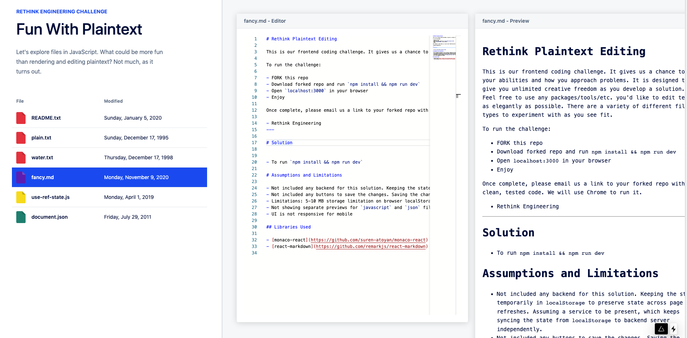
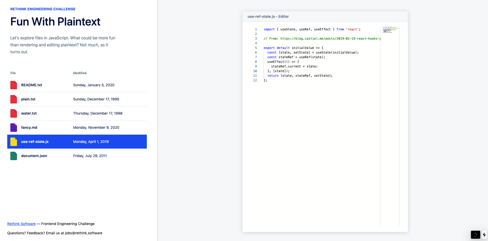

# Rethink Plaintext Editing

This is our frontend coding challenge. It gives us a chance to see your abilities and how you approach problems. It is designed to give you unlimited creative freedom as you develop a solution. Feel free to use any packages/tools/etc. you'd like to edit text as elegantly as possible. There are a variety of different file types to experiment with as you see fit.

To run the challenge:

- FORK this repo
- Download forked repo and run `npm install && npm run dev`
- Open `localhost:3000` in your browser
- Enjoy

Once complete, please email us a link to your forked repo with clean, tested code. We will use Chrome to run it.

- Rethink Engineering

---

# Solution

> [https://rethink-plaintext-editing.alokg1019.vercel.app/](https://rethink-plaintext-editing.alokg1019.vercel.app/)

- To run `npm install && npm run dev`

# Assumptions and Limitations

- Not included any backend for this solution. Keeping the state temporarily in `localStorage` to preserve state across page refreshes. Assuming a service to be present, which keeps syncing the state from `localStorage` to backend server independently.
- Not included any buttons to save the changes. Saving the changes on each key-stroke in the editor. User should not be concerned with saving if the goal is to create a web based editor running on cloud.
- Limitations: 5-10 MB storage limitation on browser localStorage.
- Not showing separate previews for `javascript` and `json` files. Just showing the editor with proper syntax highlighting.
- UI is not responsive for mobile

## Libraries Used

- [monaco-react](https://github.com/suren-atoyan/monaco-react) used for the editor.
- [react-markdown](https://github.com/remarkjs/react-markdown) used for markdown preview.
